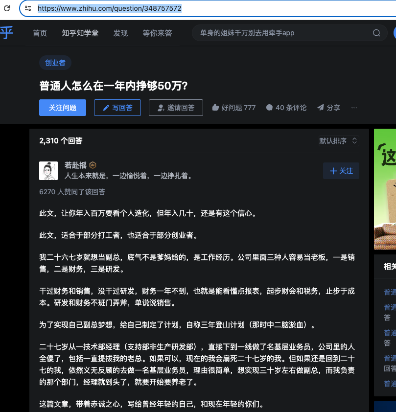
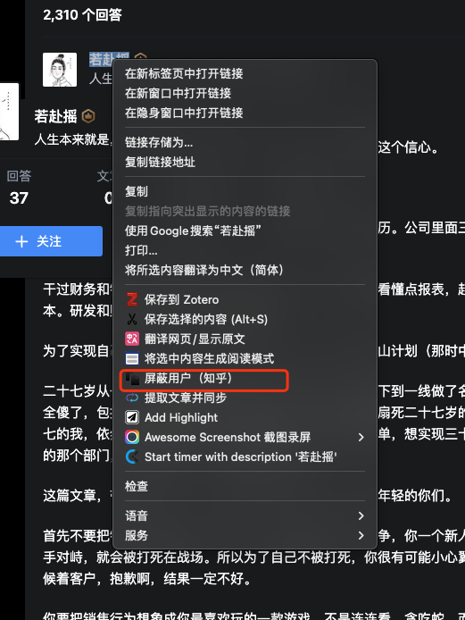
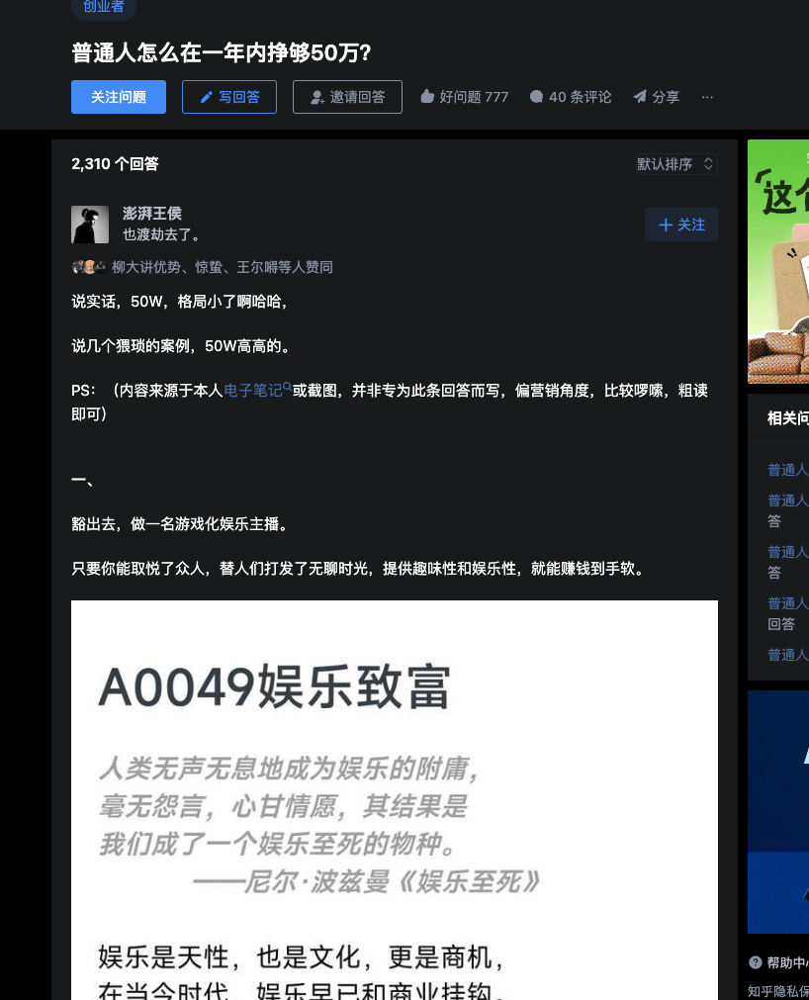

# 知乎 Black

这是一个浏览器插件，操作简单，用来屏蔽某个回答下不想看的用户回答。也会帮你屏蔽广告哦

## 安装

### Chrome

1. 克隆或下载此存储库。
2. 打开 Chrome 并导航到 `chrome://extensions/`。
3. 在右上角启用“开发者模式”。
4. 点击“加载已解压的扩展程序”，选择您克隆/下载存储库的目录。

## 使用方法

1.  打开知乎问题页面。

1.  使用鼠标左键全部选中要屏蔽的用户名。

    

2.  在右键菜单中选择“屏蔽用户（知乎）”。

刷新再进来也不会有，注意要等页面完全加载完成后才会消失

### 原理

该插件通过分析页面元素找到用户名数据，并根据用户选择的操作，从页面中删除相应的元素，实现了对知乎用户的屏蔽功能。

## 开发

如果您想为此插件的开发做出贡献，请按照以下步骤操作：

1. Fork 并克隆此存储库。
2. 进行您的更改。
3. 充分测试您的更改。
4. 提交一个解释您所做更改的拉取请求。

## 许可证

本项目采用 [MIT 许可证](LICENSE)。请根据您的需求自由使用和修改此插件。

## 致谢

- 此插件的灵感来自于在浏览网页时快速有效地复制和保存 URL 的需求。
- 特别感谢 Chrome 的开发人员提供了强大的扩展 API。

如果您遇到任何问题或有改进建议，请在 GitHub 上提出问题。感谢您使用浏览器插件 URL 复制！